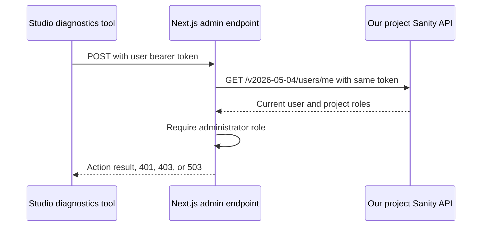

# Sanity admin authentication: code sketch

Investigated 2026-09-13. Historical proposal: these snippets are not the installed implementation. The app now uses a separate Sanity login page and a scoped HttpOnly cookie containing the Sanity session token, revalidated on each protected server request. See [application documentation](../../apps/web/README.md#admin-authentication) for the implemented design, and [feasibility findings](./sanity-admin-auth-feasibility.md) for evidence and limits.

The preferred follow-up design keeps our own admin UI. The earlier Studio-tool sketch remains below as an alternative, not a requirement of reusing Sanity login.

## Separate admin UI: the login handoff

The source-verified building block is a login-only use of `StudioProvider`, without `StudioLayout`. The provider renders its login screen and handles the callback before mounting our child component. This API is demonstrated in the advanced embedding docs but tagged beta in Sanity 6.13.1. [Embedding documentation](https://www.sanity.io/docs/nextjs/embedding-sanity-studio-in-nextjs), [pinned source](https://registry.npmjs.org/sanity/-/sanity-6.13.1.tgz)

For the application-cookie variant, the proposed flow is:

1. A private page checks the application session on the server. If absent, it sends the browser to `/admin/login` and records an allowed return path in a short-lived login transaction.
2. That public login page loads the provider below in the browser, using the same client-only loading approach as the existing Studio loader.
3. Sanity manages provider selection, login and the return callback to `/admin/login`. An existing same-project browser token may avoid a fresh sign-in.
4. Our `CompleteAdminLogin` child reads `useClient().config().token`, posts it to `/api/admin/session` with the login transaction's CSRF protection, and waits for success.
5. That endpoint validates the caller with the project `/users/me` guard below, creates a fresh application session, consumes the transaction, and sets a Secure, HttpOnly, SameSite cookie. Session creation must check the request origin and bind the attempt to the initiating browser; accepting arbitrary login POSTs would permit login CSRF.
6. The browser navigates to the validated return path, causing a fresh server request with the application cookie. Our admin page renders normally. `/admin/studio` stays the editor.

The login wrapper would look like this; `CompleteAdminLogin` names the application-owned exchange component described above, not an existing Sanity API or an implemented component in this repo:

```tsx
'use client'

import {NextStudio} from 'next-sanity/studio'
import {StudioProvider} from 'sanity'
import studioConfig from './sanity.config'

const loginConfig = {
  ...studioConfig,
  basePath: '/admin/login',
  auth: {...studioConfig.auth, loginMethod: 'token' as const},
}

export function AdminLogin() {
  return (
    <NextStudio config={loginConfig}>
      <StudioProvider config={loginConfig}>
        <CompleteAdminLogin />
      </StudioProvider>
    </NextStudio>
  )
}
```

Keep login, its callback, session creation and the Studio shell outside the application-session gate to avoid a redirect loop. The credential must only be sent in the POST header, never placed in our return URL. This sketch clones the current single-workspace config; the provider's separate `basePath` prop must not be used to override the config path because it prefixes it.

For the bearer-only variant, the same provider can wrap our own client-rendered admin UI, exposing the token for authenticated API calls without creating an application cookie. It does not have to render editor navigation or register tools. That variant still loads Studio's provider machinery on the custom admin pages and cannot guard server-rendered private data with its React boundary.

The cookie variant confines that machinery to login and the editor, but introduces a second session lifecycle. We must choose an expiry and revalidation policy, define what happens when the application session expires while the Sanity session remains valid, and explicitly end both sessions for a full sign-out. Do not claim that clearing one cookie signs the user out of Sanity or that local validation instantly reflects Sanity role removal.

Validation for this addition: traced the provider, callback, return-path and project-token storage code in the exact published version and compared the official embedding example. No live login or session exchange was performed. Browser acceptance checks must cover starting on a deep admin link, fresh and existing login, returning from the identity provider, navigation to the editor, expiry, denied roles and coordinated logout. The architecture is now concrete; the prototype and its real-session tests are still to be implemented.

## Alternative: tools inside Studio

Use the embedded Studio login, put diagnostics in a custom Studio tool, and send the user's token explicitly to our Next.js route. The server asks **our project's** Sanity API for the current user on every request and permits only the `administrator` role. This is a proposed application policy: editors and developers do not automatically get diagnostics access.



## 1. Configure token login and register the tool

Merge these fields into `apps/web/sanity.config.ts`, keeping the existing plugins:

```tsx
import {DiagnosticsTool} from './src/sanity/tools/diagnostics-tool'

// Inside the existing defineConfig({...}):
auth: {loginMethod: 'token'},
tools: (previous, {currentUser}) =>
  currentUser?.roles.some((role) => role.name === 'administrator')
    ? [...previous, {
        name: 'diagnostics',
        title: 'Diagnostics',
        component: DiagnosticsTool,
      }]
    : previous,
```

`token` is a public login configuration option. The default `dual` mode may use a Sanity-domain cookie without a JavaScript-readable token; that cookie does not authenticate a request to our Next.js host. Existing cookie sessions may need a fresh login after the change. Hiding a tool is only a UI convenience; the endpoint guard below enforces access. [AuthConfig](https://reference.sanity.io/sanity/index/AuthConfig/), [role-based Studio customization](https://www.sanity.io/learn/course/introduction-to-users-and-roles/studio-customizations)

## 2. Call the endpoint from inside Studio

Proposed `apps/web/src/sanity/tools/diagnostics-tool.tsx`:

```tsx
'use client'

import {useState} from 'react'
import {useClient} from 'sanity'

export function DiagnosticsTool() {
  const client = useClient({apiVersion: '2026-05-04'})
  const [pending, setPending] = useState(false)
  const [message, setMessage] = useState('')

  async function triggerServerError() {
    const token = client.config().token
    if (typeof token !== 'string' || !token) {
      setMessage('Sign out and sign back in to use diagnostics.')
      return
    }

    setPending(true)
    try {
      const response = await fetch('/admin/errors/server', {
        method: 'POST',
        headers: {Authorization: `Bearer ${token}`},
        credentials: 'omit',
        redirect: 'error',
        cache: 'no-store',
      })

      setMessage(
        response.status === 401 ? 'Your session was rejected. Sign in again.' :
        response.status === 403 ? 'This action requires administrator access.' :
        response.status === 503 ? 'Authentication is unavailable. Try again later.' :
        `Server returned ${response.status}. Check monitoring for the test error.`,
      )
    } catch {
      setMessage('Request failed. Try again.')
    } finally {
      setPending(false)
    }
  }

  return (
    <section>
      <button type="button" disabled={pending} onClick={triggerServerError}>
        Trigger server error
      </button>
      <p role="status">{message}</p>
    </section>
  )
}
```

The public `useClient` hook supplies the workspace client. In the pinned `sanity@6.13.1` source, `prepareConfig` derives that client from the auth state, preserving its configured token. Read it at action time; don't copy it into another persistent store, parse Studio's localStorage keys, or subscribe to hidden auth-store APIs. This uses the existing Sanity dependency; the App SDK is unnecessary for this tool. [Studio hooks](https://www.sanity.io/docs/studio/studio-react-hooks), [pinned package source](https://www.npmjs.com/package/sanity/v/6.13.1)

## 3. Authorize every server action

Proposed `apps/web/src/lib/admin-auth.ts`:

```ts
import 'server-only'

import {projectId} from '@/sanity/env'

type AdminAccess =
  | {ok: true; userId: string}
  | {ok: false; response: Response}

function deny(status: 401 | 403 | 503): AdminAccess {
  return {
    ok: false,
    response: Response.json(
      {error: status === 401 ? 'Unauthenticated' :
        status === 403 ? 'Forbidden' : 'Authentication unavailable'},
      {status, headers: {'Cache-Control': 'no-store'}},
    ),
  }
}

function isRecord(value: unknown): value is Record<string, unknown> {
  return typeof value === 'object' && value !== null && !Array.isArray(value)
}

export async function requireAdmin(request: Request): Promise<AdminAccess> {
  const authorization = request.headers.get('authorization')
  if (!authorization || !/^Bearer [^\s,]+$/i.test(authorization)) {
    return deny(401)
  }

  // Project comes from deployment configuration, never from the caller.
  // Validate before building a hostname to keep this a fixed upstream.
  if (!/^[a-z0-9]+$/.test(projectId)) return deny(503)

  try {
    const response = await fetch(
      `https://${projectId}.api.sanity.io/v2026-05-04/users/me`,
      {
        headers: {Authorization: authorization, Accept: 'application/json'},
        cache: 'no-store',
        redirect: 'error',
        signal: AbortSignal.timeout(5000),
      },
    )

    if (response.status === 401) return deny(401)
    if (response.status === 403) return deny(403)
    if (!response.ok) return deny(503)

    const user: unknown = await response.json()
    if (!isRecord(user) || typeof user.id !== 'string' || !user.id ||
        !Array.isArray(user.roles) ||
        !user.roles.every((role) => isRecord(role) && typeof role.name === 'string')) {
      return deny(503)
    }

    if (!user.roles.some((role) => isRecord(role) && role.name === 'administrator')) {
      return deny(403)
    }

    return {ok: true, userId: user.id}
  } catch {
    // Fail closed on timeout, malformed JSON, redirects, or network failure.
    // Do not log the request headers, token, or upstream response body.
    return deny(503)
  }
}
```

The endpoint and API version match Studio 6.13.1's own auth probe. Its result is passed directly to `CurrentUser`, whose roles have a `name` field. This is source-verified, but **has not been exercised with a real Studio session in this investigation**. Treat it as a candidate integration requiring the checks below, rather than a documented drop-in Next.js auth adapter. [Sanity package](https://www.npmjs.com/package/sanity/v/6.13.1), [CurrentUser types](https://www.npmjs.com/package/@sanity/types/v/6.13.1), [user-session requirement](https://www.sanity.io/docs/content-lake/build-a-custom-role-with-the-access-api)

Change `apps/web/src/app/(admin)/admin/errors/server/route.ts` to:

```ts
import {requireAdmin} from '@/lib/admin-auth'

export async function POST(request: Request) {
  const access = await requireAdmin(request)
  if (!access.ok) return access.response

  throw new Error('Admin test: unhandled server-side error')
}
```

The guard runs before the diagnostic action. Every additional admin handler or Server Action needs the same authorization boundary. A layout or hidden navigation item cannot protect an HTTP handler. A later non-diagnostic handler can use the returned user ID for an audit record, without retaining the credential.

## Route migration and scope

- Move the existing diagnostics UI into the tool. Redirect `/admin/errors` to `/admin/studio/diagnostics`, and make `/admin` lead into Studio or remain a non-sensitive landing page. Confirm the tool URL in the embedded catch-all route.
- The Studio HTML shell and login assets remain publicly reachable. Sensitive admin data is fetched only after server authorization. This bearer design does not authenticate initial server-rendered Next.js pages: browser navigation does not attach the token header.
- Keeping protected server-rendered `/admin/*` pages would require a separate application-session exchange, secure HttpOnly cookies, CSRF controls, and explicit expiry/revocation/logout handling. That is extra scope, and unnecessary for Studio tools calling APIs.
- Keep `/api/draft-mode/enable` on Sanity's preview-secret flow; don't put a blanket admin gate over it or block the Studio login callback.
- Sanity remains responsible for identity and CMS membership. Operational State remains in its existing external system of record, per ADR 003.

## Checks before implementation is considered complete

1. With actual token-mode sessions, verify administrator succeeds, editor/developer is denied, and a user who belongs only to another project is denied. Validate the returned roles against Sanity Manage, including an organization administrator with inherited project access.
2. Verify missing/invalid credentials, a robot token, expired/revoked sessions, and removed membership cannot run the action. Verify logout and another browser tab's logout; don't assume local token removal proves server revocation.
3. Check browser reload, login callback and token availability in Chrome and Safari, plus existing Presentation/draft-mode flows. Confirm Studio's auth state updates replace the client exposed to the tool.
4. Exercise upstream timeout, 429/5xx, malformed JSON/role shapes and redirects. All must deny execution; this sketch maps unexpected upstream statuses, including 404, to 503 until actual semantics are confirmed.
5. Add meaningful guard tests for those decisions and prove a denied request does not execute the protected handler. No positive-result cache in the first implementation; rechecking each action avoids introducing our own stale-role window, though Sanity propagation time still applies.
6. Keep bearer headers out of logs and analytics. Token mode stores credentials in JavaScript-accessible browser storage, so scripts on the shared public-site/Studio origin are within that credential's exposure boundary. Explicit bearer auth avoids cookie-based CSRF for these handlers; keep them same-origin without permissive CORS.

Validation performed here: inspected exact published Sanity 6.13.1 code and type definitions, compared official docs, and reviewed the existing routes. No application dependencies were installed, no live user credentials were used, and no production route was changed. The code is an illustrative sketch, not typechecked or integration-tested application code.
